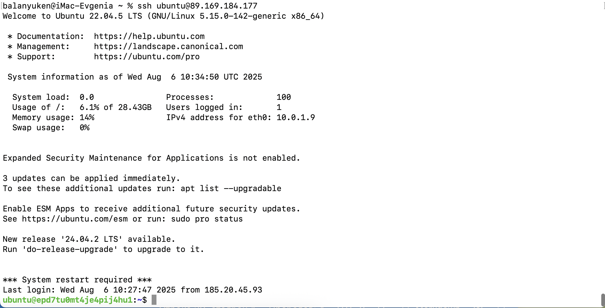

## Задание
Написать скрипт на bash для мониторинга процесса test в среде linux.
Скрипт должен отвечать следующим требованиям:

1 Запускаться при запуске системы (предпочтительно написать юнит
systemd в дополнение к скрипту)

2 Отрабатывать каждую минуту

3 Если процесс запущен, то стучаться(по https) на
https://test.com/monitoring/test/api

4 Если процесс был перезапущен, писать в лог /var/log/monitoring.log
(если процесс не запущен, то ничего не делать)

5 Если сервер мониторинга не доступен, так же писать в лог.

## Решение

1. С помощью terraform создаем ВМ с ОС Ubuntu 22.04 LTS

[Скрипт для установки ВМ в Yandex Cloud](vm.tf)

Виртуальная машина, сеть и подсеть созданы

2. Скрипт для мониторинга процесса test

[monitoring](monitoring.sh)

3. Playbook для установки мониторинга и модулей на ВМ

[playbook](playbook.yaml)

4. Проверка работоспособности мониторинга

- Подключаемся к ВМ

- Проверяем статус таймера

*systemctl status monitoring.timer*

- Проверяем статус сервиса

*systemctl status monitoring.service*

- Проверяем мониторинг процесса

*journalctl -u monitoring.service -f*

- Проверка доступности сервера мониторинга.

*sudo tail -f /var/log/monitoring.log*

- Проверка перезапуска сервиса мониторинга

*sudo systemctl daemon-reload*

*sudo systemctl restart monitoring.service*

